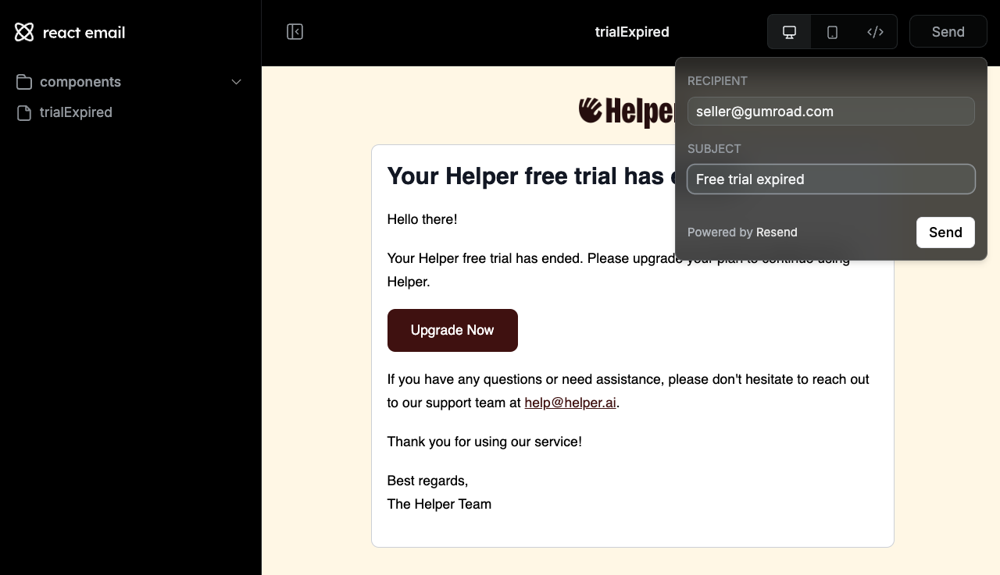

# Local Development Guide

## Setting Up Local Development

First, install local Certificate Authority:

```sh
# Install mkcert on macOS
brew install mkcert
brew install nss
```

_For other operating systems, see the [mkcert installation guide](https://github.com/FiloSottile/mkcert?tab=readme-ov-file#installation)._

Then, create a local Certificate Authority and generate SSL certificates for the Helper development project:

```sh
# Generate SSL certificates
bin/generate_ssl_certs
```

Run the application and access it at [helperai.dev](https://helperai.dev):

```sh
bin/dev
# Run `LOCAL_DETACHED=false make local` first if you prefer to run Docker services in the foreground
```

## Database Management

Seed the database with sample data: (email/password: `support@gumroad.com` / `password` and `user1,...,user4@gumroad.com` / `password`)

```sh
npm run db:reset
```

Generate/run database migrations:

```sh
npm run db:generate
npm run db:migrate
```

## Testing

```sh
# Run all tests
npm test

# Run a specific test file
(cd apps/nextjs && npx vitest run tests/inngest/functions/postEmailToGmail.test.ts)
```

## Background Tasks

This project uses [Inngest](https://www.inngest.com/) for background tasks. You can view the dashboard / development server at [http://localhost:8288/](http://localhost:8288/).

## Email Development

While email sending/receiving in a customer's inbox happens through Gmail, all other emails get sent using Resend and are defined at `src/emails`. To preview an email, you can visit http://localhost:3060. You can also send yourself a preview email (note that some assets like images may not properly display when sending a preview email during local development):



## Langfuse AI Tracing

To access Langfuse to view AI traces:

1. Access the Langfuse UI at: http://localhost:3020

2. Log in with the automatically created user:
   - Email: dev@helper.ai
   - Password: password

This user is automatically created for the Langfuse instance running inside Docker Compose.

You can now view and analyze AI traces for the Helper development project.
